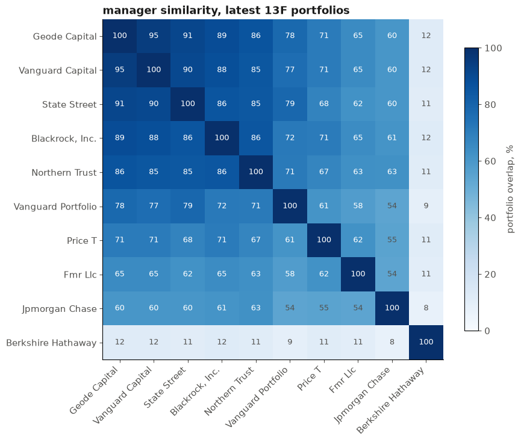
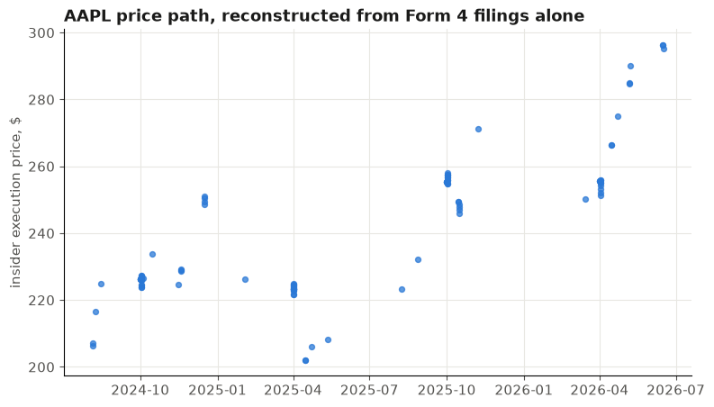
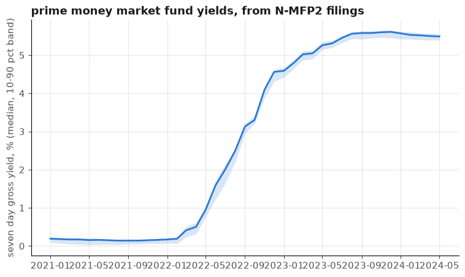
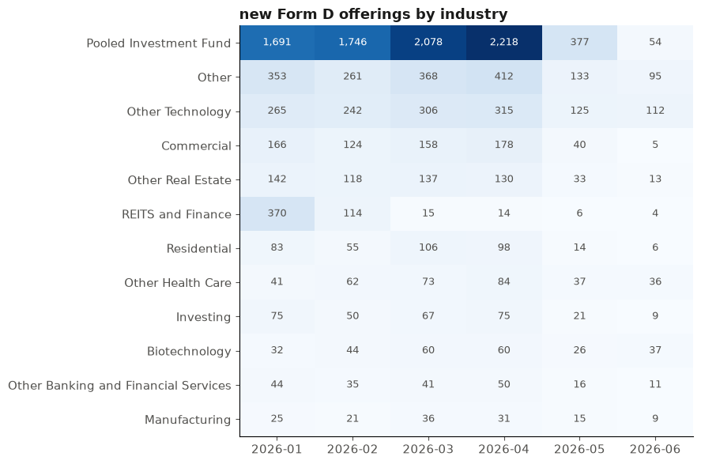

# py3spread

Python client for the [3spread](https://3spread.com) API: machine-readable SEC
filing data (insider transactions, 13F holdings, fund portfolios, beneficial
ownership, and more).

[Documentation](https://3spread.github.io/py3spread/) ·
[Examples](examples/) ·
[3spread API reference](https://3spread.com/docs)

**API keys are always free for individuals.** Sign up at
[3spread.com/auth/signup](https://3spread.com/auth/signup) and you get full
access to every dataset at 300 requests/minute.

## Install

```bash
pip install py3spread
```

Requires Python 3.10+.

## Public beta

3spread is in [public beta](https://3spread.com/beta): live, but still
rounding off the rough edges. History currently reaches back to filings
accepted in early 2021, with deeper coverage expanding per the roadmap.
Expect some coverage gaps across filing types,
fields, and history windows, the occasional filing that parses wrong, and
endpoints that may evolve with feedback. The
[roadmap](https://3spread.com/roadmap) shows what's live now and what's
coming next, and it's driven by community requests. Rather than assuming a
gap, check what's actually populated via the coverage endpoints
(`client.coverage`, see below).

## Quickstart

API keys are free, always, in beta and after. Grab one at
[3spread.com/auth/signup](https://3spread.com/auth/signup), then:

```python
from py3spread import Client

client = Client()  # reads THREESPREAD_API_KEY from the environment

page = client.filings.list(ticker="AAPL", limit=5)
for filing in page["data"]:
    print(filing["form_type"], filing["accepted_time"], filing["source_url"])
```

You can also pass the key directly with `Client(api_key="...")`.

## What the data can do

A few results straight out of the [examples](examples/), every one of
them built with a Community API key.

### Which managers actually differ from the index

Ten managers' latest 13F portfolios, pairwise overlap, clustered. The
custodian complex holds the market; Berkshire sits alone in its corner.



```python
weights = portfolio.groupby("cusip")["value_usd"].sum() / total
common = a.index.intersection(b.index)
overlap = np.minimum(a[common], b[common]).sum()
```

From [`institutional_13f.ipynb`](examples/notebooks/institutional_13f.ipynb).
The two-manager version lives in
[`fund_overlap.ipynb`](examples/notebooks/fund_overlap.ipynb).

### A price chart with no market data

Every insider transaction reports its execution price. Two years of Form 4
prices trace the stock, no exchange feed involved.



```python
for txn in client.insiders.iter_transactions(
    issuer_ticker="AAPL", transaction_kind="nonderiv",
    transaction_start="2024-07-01", transaction_end="2026-07-01",
):
    plot(txn["transaction_date"], txn["transaction_price_per_share"])
```

From [`form4_price_chart.ipynb`](examples/notebooks/form4_price_chart.ipynb).

### The Fed cycle, out of money market filings

Median prime fund yield with a 10th-90th percentile band, built from the
seven day gross yield every fund reports monthly on Form N-MFP.



```python
for filing in client.money_market_funds.iter(cik=registrant, ...):
    panel.append((filing["period_of_report"], filing["seven_day_gross_yield"]))
```

From [`rate_cycle.ipynb`](examples/notebooks/rate_cycle.ipynb), which also
runs per-fund pass-through regressions.

### The private capital map

Form D exempt offerings by industry and month. 319K+ filings almost nobody
parses.



```python
offerings = client.private_offerings.iter(
    accepted_start="2026-01-01", accepted_end="2026-01-31")
```

From [`form_d_heatmap.ipynb`](examples/notebooks/form_d_heatmap.ipynb).

More in [`examples/`](examples/): an activist 13D radar, insider dossiers,
money market stress ranking, a live filing tape, and a dozen others.

## Datasets

Each filing family is a resource on the client:

| Resource | Dataset |
|---|---|
| `client.filings` | Master filings index (all families) |
| `client.insiders` | Forms 3, 4, 5 insider filings and transactions |
| `client.institutional_holdings` | Form 13F filings and holdings |
| `client.private_offerings` | Form D offering notices |
| `client.fund_portfolios` | Form N-PORT portfolio holdings |
| `client.beneficial_ownership` | Schedule 13D / 13G reports |
| `client.proposed_sales` | Form 144 proposed sales |
| `client.fund_census` | Form N-CEN census reports |
| `client.money_market_funds` | Form N-MFP2/N-MFP3 reports and NAV series |
| `client.proxy_votes` | Form N-PX voting records |
| `client.reg_a_offerings` | Regulation A+ offerings |
| `client.registration_statements` | Registration statements and text sections (still being populated) |
| `client.entities` | Master CIK directory |
| `client.coverage` | Coverage and freshness endpoints |
| `client.changes` | Per-family changefeed |

`list()` returns one raw page as a dict. `iter()` (and `iter_transactions()`,
`iter_holdings()`, etc.) handles pagination for you and yields rows:

```python
for txn in client.insiders.iter_transactions(issuer_ticker="AAPL",
                                             transaction_start="2026-01-01",
                                             transaction_end="2026-06-30"):
    print(txn)
```

List endpoints require at least one identity filter (`cik`, `ticker`, or a
family id like `issuer_cik`) or a fully bounded date window; unfiltered calls
return a 400.

## Keeping a downstream store in sync

Poll the changefeed per family:

```python
for event in client.changes.iter("insiders", since="2026-07-01T00:00:00"):
    print(event["filing_id"], event["action"])
```

## Errors and retries

HTTP errors raise typed exceptions from `py3spread`, all subclasses of
`ThreeSpreadError`: `AuthenticationError` (401), `RateLimitError` (429),
`WindowTooWideError` / `MissingParameterError` / `BadRequestError` (400),
`NotFoundError` (404), `ValidationError` (422), `ServerError` (500/502), and
`ServiceUnavailableError` (503). Each carries `status_code`, `code`,
`request_id`, and `details` where available.

429, 502, and 503 are retried automatically with backoff (configurable via
`Client(max_retries=...)`).

## Notes on values

Monetary and ratio fields come back as strings at full precision, for example
`"360836000000.00"`. Parse them with `decimal.Decimal`, not `float`. Filing
datetimes such as `accepted_time` are timezone-naive ISO 8601 strings, as
filed with the SEC.

Tickers are uppercased for you before sending (the API rejects lowercase).

## Development

```bash
uv venv && uv pip install -e ".[dev]"
pytest
```

## Links

- [Client documentation](https://3spread.github.io/py3spread/)
- [API reference](https://3spread.com/docs)
- [Public beta status](https://3spread.com/beta)
- [Roadmap](https://3spread.com/roadmap)
- [Plans](https://3spread.com/plans)
